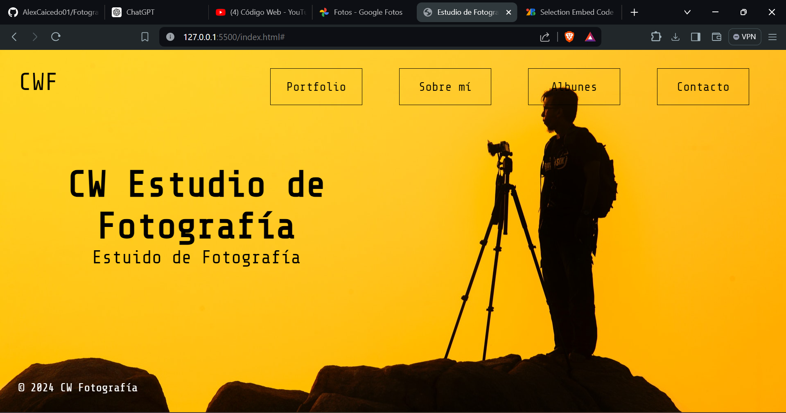

# CW Estudio de Fotografía

Este es un proyecto ficticio para un Estudio de Fotografía llamado CW Fotografía.

## Tecnologías Utilizadas

- <a href="https://developer.mozilla.org/en-US/docs/Web/HTML"> HTML</a>
- <a href="https://developer.mozilla.org/en-US/docs/Web/CSS"> CSS</a>

## Captura de Pantalla

## Autor

[AlexCaicedo1](https://github.com/AlexCaicedo01)
